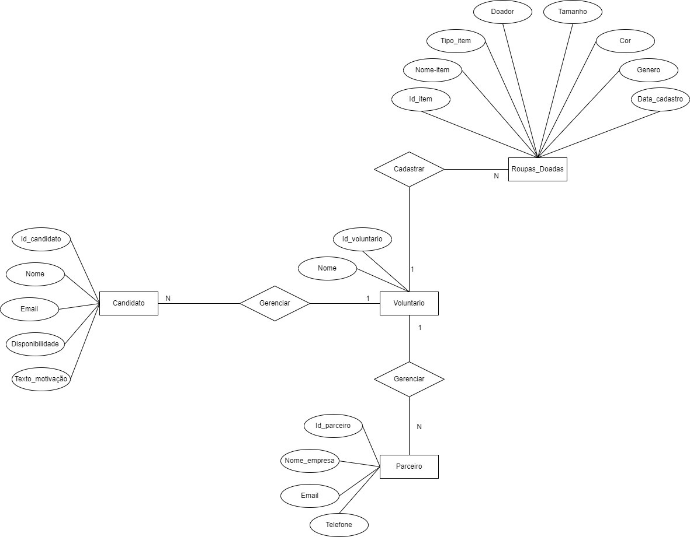

# Arquitetura da Solução

Pré-requisitos: <a href="3-Projeto de Interface.md"> Projeto de Interface</a>

Definição de como o software é estruturado em termos dos componentes que fazem parte da solução e do ambiente de hospedagem da aplicação.

## Diagrama de Classes

O diagrama de classes ilustra graficamente como será a estrutura do software, e como cada uma das classes da sua estrutura estarão interligadas. Essas classes servem de modelo para materializar os objetos que executarão na memória.

Figura 09: Diagrama de Classes.

## Modelo ER (Projeto Conceitual)

O Modelo ER representa através de um diagrama como as entidades (coisas, objetos) se relacionam entre si na aplicação interativa.

Figura 10: Modelo ER (Projeto Conceitual).

## Projeto da Base de Dados

O projeto da base de dados corresponde à representação das entidades e relacionamentos identificadas no Modelo ER, no formato de tabelas, com colunas e chaves primárias/estrangeiras necessárias para representar corretamente as restrições de integridade.

Figura 11: Projeto da Base de Dados.

## Tecnologias Utilizadas

As tecnologias utilizadas para o desenvolvimento da aplicação são:
- Linguagem: C#, HTML e CSS;
- IDE: Visual Studio Comunity 2022;
- Framework: Entity e Razor;
- Ferramentas: LucidApp, draw.io, MarvelApp, Bootstrap, MSSQL Server e Github;
- Serviços web: SmarterASP.NET.

Através do .NET 8.0 integrada a IDE Visual Studio 2022 e utilizando-se dos Frameworks Entity e Razor foram desenvolvidas as estruturas necessárias às funcionalidades e armazenamento de informações no Banco de Dados MSSQL server, gerando  parte visual e de interação do usuário. A navegabilidade do usuário se dá através das páginas de cada ambiente da aplicação para exercer suas respectivas funcionalidades.

## Hospedagem

A hospedagem da aplicação se deu utilizando a plataforma web SmarterASP.NET que permite 60 dias gratuitos para hospedagem da aplicação e banco de dados MSSQL. O endereço para acesso e credenciais necessárias para o acesso (exigência obrigatória do plano gratuito do SmarterASP.NET) seguem abaixo:

- URL de acesso: http://clarenceaguiar-001-site1.gtempurl.com/
- Nome de usuário: 11176862
- Senha: 60-dayfreetrial
