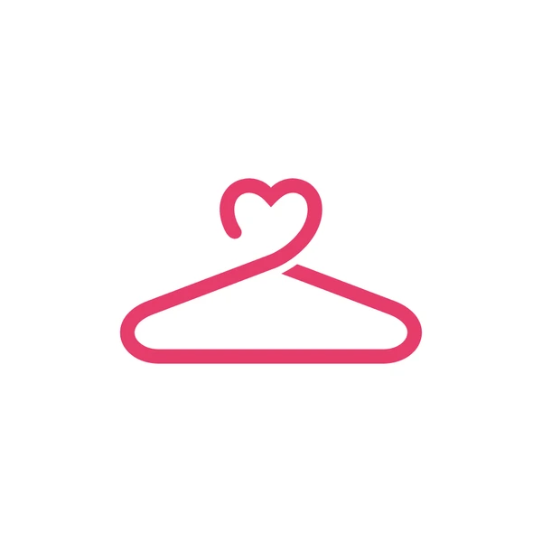

# Template Padrão da Aplicação

Pré-requisitos: <a href="2-Especificação do Projeto.md"> Especificação do Projeto</a>, <a href="3-Projeto de Interface.md"> Projeto de Interface</a>, <a href="4-Metodologia.md"> Metodologia</a>

Layout padrão do site (HTML e CSS, através do Razor) que será utilizado em todas as páginas com a definição de identidade visual e aspectos de responsividade.

As páginas possuem como elementos padrões o menu de navegação, o header e o footer, além dos elementos de identidade visual citados abaixo:

Cores: lightgray, slategray, ghostwhite, #ffffff e #f3f2ed;  
Font-family: arial e sans-serif;  
Fonte-size: 14px, 16px e 25px.

O código utilizado para a construção dos elementos citados, incluindo a responsividade, pode ser consultado <a href="https://github.com/ICEI-PUC-Minas-PMV-ADS/pmv-ads-2024-1-e2-proj-int-t2-cabide-solidario/tree/3c0fe289418355a5b055cdf4d99a75d9d71ce645/src/cabide-solidario">aqui</a>. As imagens e ícones utilizados no projeto estão disponíveis <a href="[https://github.com/ICEI-PUC-Minas-PMV-ADS/pmv-ads-2023-2-e1-proj-web-t2-projeto_start_na_cozinha_g4/tree/main/codigo-fonte/img](https://github.com/ICEI-PUC-Minas-PMV-ADS/pmv-ads-2024-1-e2-proj-int-t2-cabide-solidario/tree/3c0fe289418355a5b055cdf4d99a75d9d71ce645/src/cabide-solidario/wwwroot)">aqui</a>.

## LOGO

Para a criação do logotipo do site foi utilizada a cor rosa com fundo branco para manter uma imagem mais limpa e contrastada. A utilização de um cabide com a ponta de coração, transparecendo o sentimento por trás do objeto e o que ele representa.

Figura 12 - Logotipo da aplicação web Cabide Solidário

## Tela inicial (home) do site

Exibe a página inicial da aplicação, com um texto introdutório e informações gerais do proejeto, além disso possibilita o login para acesso as demais áreas de acordo com as permissões do usuário.

Figura 13 - Tela home da aplicação

> **Links Úteis**:
>
> - [CSS Website Layout (W3Schools)](https://www.w3schools.com/css/css_website_layout.asp)
> - [Website Page Layouts](http://www.cellbiol.com/bioinformatics_web_development/chapter-3-your-first-web-page-learning-html-and-css/website-page-layouts/)
> - [Perfect Liquid Layout](https://matthewjamestaylor.com/perfect-liquid-layouts)
> - [How and Why Icons Improve Your Web Design](https://usabilla.com/blog/how-and-why-icons-improve-you-web-design/)
